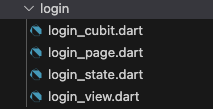

# list_cubit_template

A brick created some class template use bloc cubit with freezed.

## How to use 🚀

```bash
mason make list_cubit_template --featureName example -o lib/pages 

# Generate freezed
flutter pub run build_runner build --delete-conflicting-outputs
```

Replace __example__ by your feature name;
Replace __lib/pages__ by your folder;

## Variables for a Config ✨

| Variable      | Description                                                                    | Type     |
| ------------- | ------------------------------------------------------------------------------ | -------- |
| `featureName`  | The name of the feature                                                       | `string` |

## Outputs 📦
```
mason make list_cubit_template -o lib/pages --featureName login
```



### login_cubit.dart

```dart
import 'package:flutter_bloc/flutter_bloc.dart';
import 'package:freezed_annotation/freezed_annotation.dart';

part 'login_cubit.freezed.dart';
part 'login_state.dart';

class LoginCubit extends Cubit<LoginState> {
  LoginCubit() : super(const LoginState.initial());
}
```

### login_state.dart

```dart
part of 'login_cubit.dart';

@freezed
class LoginState with _$LoginState {
  
  const factory LoginState.initial() = _Initial;

  const factory LoginState.loading() = _Loading;

  const factory LoginState.success() = _Success;

  const factory LoginState.failure({
    @required String errorMessage,
  }) = _Failure;
}
```

### login_page.dart

```dart
import 'package:flutter/material.dart';
import 'package:flutter_bloc/flutter_bloc.dart';

import 'login_cubit.dart';

part 'login_view.dart';

class LoginPage extends StatelessWidget {
  const LoginPage({super.key});

  @override
  Widget build(BuildContext context) {
    return BlocProvider(
      create: (context) {
        return LoginCubit();
      },
      child: BlocListener<LoginCubit, LoginState>(
        listener: (context, state) {
          state.whenOrNull(failure: (errorMessage) {
            _onShowErrorMessage(context, errorMessage: errorMessage);
          });
        },
        child: _LoginView(),
      ),
    );
  }

  void _onShowErrorMessage(BuildContext context, {
    required String errorMessage,
  }) {
    ScaffoldMessenger.of(context).showSnackBar(
      SnackBar(
        content: Text(errorMessage),
        duration: Duration(seconds: 2),
      ),
    );
  }
}

```

### login_view.dart

```dart
part of 'login_page.dart';

class _LoginView extends StatefulWidget {
  const _LoginView();

  @override
  _LoginViewState createState() => _LoginViewState();
}

class _LoginViewState extends State<_LoginView> {
  late LoginCubit _loginCubit;

  @override
  void initState() {
    _loginCubit = context.read<LoginCubit>();
    super.initState();
  }

  @override
  Widget build(BuildContext context) {
    return Scaffold(
      body: _buildBody(),
    );
  }

  Widget _buildBody() {
    return BlocBuilder<LoginCubit, LoginState>(
      builder: (context, state) {
        return state.maybeWhen(
          failure: (error) {
            return Text(error);
          },
          orElse: () {
            return Text("login");
          },
        );
      },
    );
  }
}

```